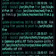

## This Article is hosted specifically for Shell Scripting
----------------------------------------------------------

_**Disclaimer:** The Author and the Publisher of this article hereby suggest that you first focus on the videos and then  do the self-practice. Use Notes for your references while practicing & not the videos. Self-practice only after finished watching the videos; do not try both at the same time (Recommended)_

### Prerequisites:

* [What is Linux Operating System?](https://www.youtube.com/watch?v=7rfbFpV-r6k){:target="_blank"}

* [What is Linux Shell and Terminal?](https://www.youtube.com/watch?v=yxmCgvpfz3Q){:target="_blank"}

* [How to Connect Linux shell from Windows?](https://www.youtube.com/watch?v=0lU_lH57T1s){:target="_blank"}
  

* Before Starting the Shell scripting and Regex tutorials, kindly complete the _[Linux Classroom sessions by Khaja](https://www.youtube.com/watch?v=1oMBgXsMtCk&list=PLuVH8Jaq3mLtx82QrxoUre38AqJQwQ3bs&pp=iAQB){:target="_blank"}_ from _**Session 01**_ to _**Session 23**_

### ShellScripting Lectures:

> [ShellScript Class-1](https://www.youtube.com/watch?v=3U7zH27lQ5s){:target="_blank"} _**Session 24**_

* [Class-1 Notes _(Unfortunately No Notes available for Class-1)!_]()

> [ShellScript Class-2](https://www.youtube.com/watch?v=uSfbVmvhzcQ){:target="_blank"} _**Session 25**_

* [Class-2 Notes](https://directdevops.blog/2020/08/25/linux-classroom-series-25-aug-2020/){:target="_blank"}

> [ShellScript Class-3](https://www.youtube.com/watch?v=u7ygLBX0olc){:target="_blank"} _**Session 26**_

* [Class-3 Notes](https://directdevops.blog/2020/08/27/linux-classroom-series-26-aug-2020/){:target="_blank"}

> [ShellScript Class-4](https://www.youtube.com/watch?v=RQ1ut1myiKs){:target="_blank"} _**Session 27**_

* [Class-4 Notes](https://directdevops.blog/2020/08/29/linux-classroom-series-28-aug-2020//){:target="_blank"}

> [ShellScript Class-5](https://www.youtube.com/watch?v=pI1e7ywGnPo){:target="_blank"} _**Session 28**_

* [Class-5 Notes](https://directdevops.blog/2020/08/31/linux-classroom-series-31-aug-2020/){:target="_blank"}

> [ShellScript Class-6](https://www.youtube.com/watch?v=LhBK_WD12VY){:target="_blank"} _**Session 29**_

* [Class-6 Notes](https://directdevops.blog/2020/09/01/linux-classroom-series-01-sept-2020/){:target="_blank"}

> [ShellScript Class-7](https://www.youtube.com/watch?v=Z3IkX_IoNe0){:target="_blank"} _**Session 30**_

* [Class-7 Notes](https://directdevops.blog/2020/09/02/linux-classroom-series-02-sept-2020/){:target="_blank"}
  
> [ShellScript Class-8](https://www.youtube.com/watch?v=_QO8_A4pAdw){:target="_blank"} _**Session 31**_

* [Class-8 Notes](https://directdevops.blog/2020/09/03/linux-classroom-series-03-sept-2020/){:target="_blank"}

> [ShellScript Class-9](https://www.youtube.com/watch?v=yJQarogBKCE){:target="_blank"} _**Session 32**_

* [Class-9 Notes](https://directdevops.blog/2020/09/04/linux-classroom-series-04-sept-2020/){:target="_blank"}

> [ShellScript Class-10](https://www.youtube.com/watch?v=Fehii6X0S2U){:target="_blank"} _**Session 33**_

* [Class-10 Notes](https://directdevops.blog/2020/09/07/linux-classroom-series-07-sept-2020/){:target="_blank"}

> [ShellScript Class-11](https://www.youtube.com/watch?v=EUE-m94O3x0){:target="_blank"} _**Session 34**_

* [Class-11 Notes](https://directdevops.blog/2020/09/08/linux-classroom-series-08-sept-2020/){:target="_blank"}

> [ShellScript Class-12(Regex)](https://www.youtube.com/watch?v=ThjHS1xT-GM){:target="_blank"} _**Session 35**_

* [Class-12 Notes(Regex)](https://directdevops.blog/2020/09/12/linux-classroom-series-11-sept-2020/){:target="_blank"}

> [ShellScript Class-13(Regex)](https://www.youtube.com/watch?v=F7XsKB3c7JA&list=PLuVH8Jaq3mLtx82QrxoUre38AqJQwQ3bs&index=37){:target="_blank"} _**Session 36**_

* [Class-13 Notes(Regex)](https://directdevops.blog/2020/09/14/linux-classroom-series-14-sept-2020/){:target="_blank"}

> [ShellScript Class-14(Regex)](https://www.youtube.com/watch?v=jd1xZhFZB0E){:target="_blank"} _**Session 37**_

* [Class-14 Notes(Regex)](https://directdevops.blog/2020/09/16/linux-classroom-series-16-sept-2020/){:target="_blank"}

> [ShellScript Class-15(Regex)](https://www.youtube.com/watch?v=7xVpZteYPVI&list=PLuVH8Jaq3mLtx82QrxoUre38AqJQwQ3bs&index=39){:target="_blank"} _**Session 38**_

* [Class-15 Notes(Regex)](https://directdevops.blog/2020/09/17/linux-classroom-series-17-sept-2020/){:target="_blank"}

> [ShellScript Class-16(Regex)](https://www.youtube.com/watch?v=PcRNWYEEE5c&list=PLuVH8Jaq3mLtx82QrxoUre38AqJQwQ3bs&index=40){:target="_blank"} _**Session 39**_

* [Class-16 Notes(Regex)](https://directdevops.blog/2020/09/19/linux-classroom-series-19-sept-2020/){:target="_blank"}

## References ~

_[Linux Foundation Notes](https://directdevops.blog/foundation-series/linux-foundation-series/){:target="_blank"}_

_[Scripting Sessions](https://directdevops.blog/scripting-sessions/){:target="_blank"}_

<!-- 

 -->

